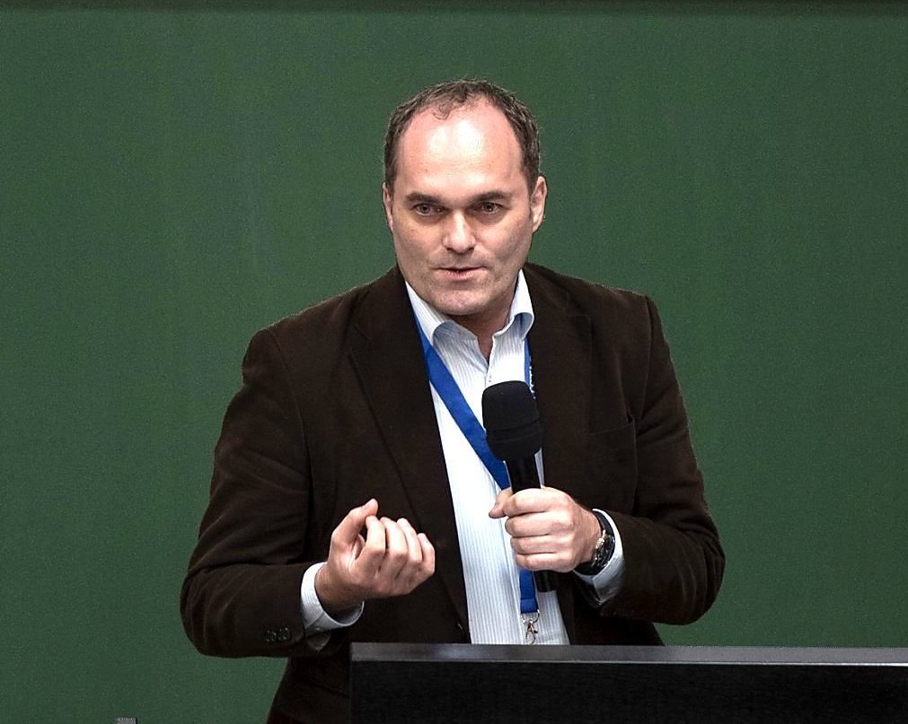

## Contact Information

::: {.grid}

::: {.g-col-6}

{width=100%}

:::
  
::: {.g-col-6}

    Dr. Peter Ebenhoch
    pe@peterebenhoch.com
    https://linkedin.com/in/ebenhoch

    +41 78 932 19 19


:::
  
:::

---

## Contact Form

Contact me using the form below.

```{=html}
<style>
/* Improve checkbox visibility */
.form-check-input {
  border: 2px solid #495057 !important;
  width: 1.2em;
  height: 1.2em;
  background-color: #ffffff;
}

.form-check-input:checked {
  background-color: #8C1515;
  border-color: #8C1515 !important;
}

.form-check-input:focus {
  border-color: #8C1515 !important;
  box-shadow: 0 0 0 0.2rem rgba(140, 21, 21, 0.25);
}
</style>

<form id="contact-form" class="needs-validation" novalidate>

  <!-- Email Field -->
  <div class="mb-4">
    <label for="email" class="form-label">Email Address <span class="text-danger">*</span></label>
    <input type="email" class="form-control" id="email" name="email" required placeholder="your.email@example.com">
    <div class="invalid-feedback">Please provide a valid email address.</div>
  </div>

  <!-- Interests Section -->
  <div class="mb-4">
    <label class="form-label">I'm interested in: <span class="text-danger">*</span></label>
    <small class="form-text text-muted d-block mb-3">Please select at least one option</small>
    
    <div class="row">
      <!-- Left Column: Areas of Interest -->
      <div class="col-md-6">
        <h6 class="mb-3">Areas of Interest</h6>
        <div class="form-check mb-2">
          <input class="form-check-input" type="checkbox" name="interests[]" value="transformational-governance" id="interest-dg">
          <label class="form-check-label" for="interest-dg">Transformational Governance</label>
        </div>
        <div class="form-check mb-2">
          <input class="form-check-input" type="checkbox" name="interests[]" value="information-security-data-sovereignty" id="interest-is">
          <label class="form-check-label" for="interest-is">Information Security & Data Sovereignty</label>
        </div>
        <div class="form-check mb-2">
          <input class="form-check-input" type="checkbox" name="interests[]" value="digital-law-counseling" id="interest-tl">
          <label class="form-check-label" for="interest-tl">Digital Law Counseling</label>
        </div>
      </div>
      
      <!-- Right Column: Contact Options -->
      <div class="col-md-6">
        <h6 class="mb-3">Contact Options</h6>
        <div class="form-check mb-2">
          <input class="form-check-input" type="checkbox" name="interests[]" value="keep-me-posted" id="interest-kmp" checked>
          <label class="form-check-label" for="interest-kmp">Keep me posted about website updates (low frequency)</label>
        </div>
        <div class="form-check mb-2">
          <input class="form-check-input" type="checkbox" name="interests[]" value="contact-me-directly" id="interest-cmd">
          <label class="form-check-label" for="interest-cmd">Contact me directly</label>
        </div>
      </div>
    </div>
    <div class="invalid-feedback d-block" id="interests-error" style="display: none !important;">Please select at least one interest.</div>
  </div>

  <!-- Privacy Notice -->
  <div class="mb-3">
    <small class="form-text text-muted">Personal data is only processed for the purpose selected. You can unsubscribe any time.</small>
  </div>

  <!-- Submit Button -->
  <div class="mb-3">
    <button type="submit" class="btn" id="submit-btn" style="background-color: #8C1515; color: #FFFFFF; border-color: #8C1515;" onmouseover="this.style.backgroundColor='#6B0F0F'" onmouseout="this.style.backgroundColor='#8C1515'">
      <span class="spinner-border spinner-border-sm d-none" id="submit-spinner" role="status" aria-hidden="true"></span>
      <span id="submit-text">Submit</span>
    </button>
  </div>

  <!-- Success/Error Messages -->
  <div id="form-message" class="alert d-none" role="alert"></div>

</form>

<script>
// Form validation and submission
(function() {
  'use strict';
  
  const form = document.getElementById('contact-form');
  const emailInput = document.getElementById('email');
  const interestsCheckboxes = document.querySelectorAll('input[name="interests[]"]');
  const interestsError = document.getElementById('interests-error');
  const submitBtn = document.getElementById('submit-btn');
  const submitSpinner = document.getElementById('submit-spinner');
  const submitText = document.getElementById('submit-text');
  const formMessage = document.getElementById('form-message');

  // Custom validation for interests
  function validateInterests() {
    const checked = Array.from(interestsCheckboxes).some(cb => cb.checked);
    if (!checked) {
      interestsError.style.display = 'block';
      return false;
    }
    interestsError.style.display = 'none';
    return true;
  }

  // Validate interests on checkbox change
  interestsCheckboxes.forEach(checkbox => {
    checkbox.addEventListener('change', validateInterests);
  });

  // Form submission
  form.addEventListener('submit', async function(event) {
    event.preventDefault();
    event.stopPropagation();

    // Reset previous messages
    formMessage.classList.add('d-none');
    formMessage.classList.remove('alert-success', 'alert-danger');

    // Validate email (browser validation)
    if (!emailInput.checkValidity()) {
      form.classList.add('was-validated');
      return;
    }

    // Validate interests
    if (!validateInterests()) {
      form.classList.add('was-validated');
      return;
    }

    // Disable submit button and show loading
    submitBtn.disabled = true;
    submitSpinner.classList.remove('d-none');
    submitText.textContent = 'Submitting...';

    // Collect form data
    const formData = new FormData(form);
    const data = {
      email: formData.get('email'),
      interests: formData.getAll('interests[]')
    };

    try {
      const response = await fetch('/api/submit-contact.php', {
        method: 'POST',
        headers: {
          'Content-Type': 'application/json',
        },
        body: JSON.stringify(data)
      });

      const result = await response.json();

      if (response.ok) {
        // Success
        formMessage.classList.add('alert-success');
        formMessage.textContent = result.message || 'Thank you! Your message has been submitted successfully.';
        formMessage.classList.remove('d-none');
        form.reset();
        form.classList.remove('was-validated');
        // Reset "keep me posted" to checked (default)
        document.getElementById('interest-kmp').checked = true;
      } else {
        // Error
        formMessage.classList.add('alert-danger');
        formMessage.textContent = result.error || 'An error occurred. Please try again later.';
        formMessage.classList.remove('d-none');
      }
    } catch (error) {
      formMessage.classList.add('alert-danger');
      formMessage.textContent = 'Network error. Please check your connection and try again.';
      formMessage.classList.remove('d-none');
    } finally {
      // Re-enable submit button
      submitBtn.disabled = false;
      submitSpinner.classList.add('d-none');
      submitText.textContent = 'Submit';
    }
  });
})();
</script>
```