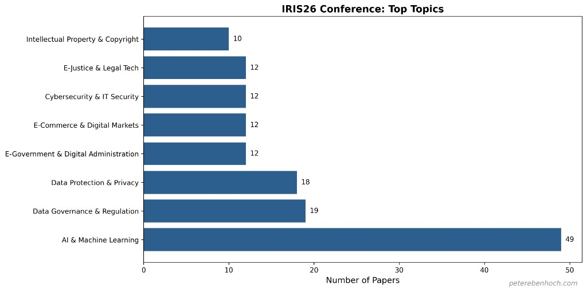
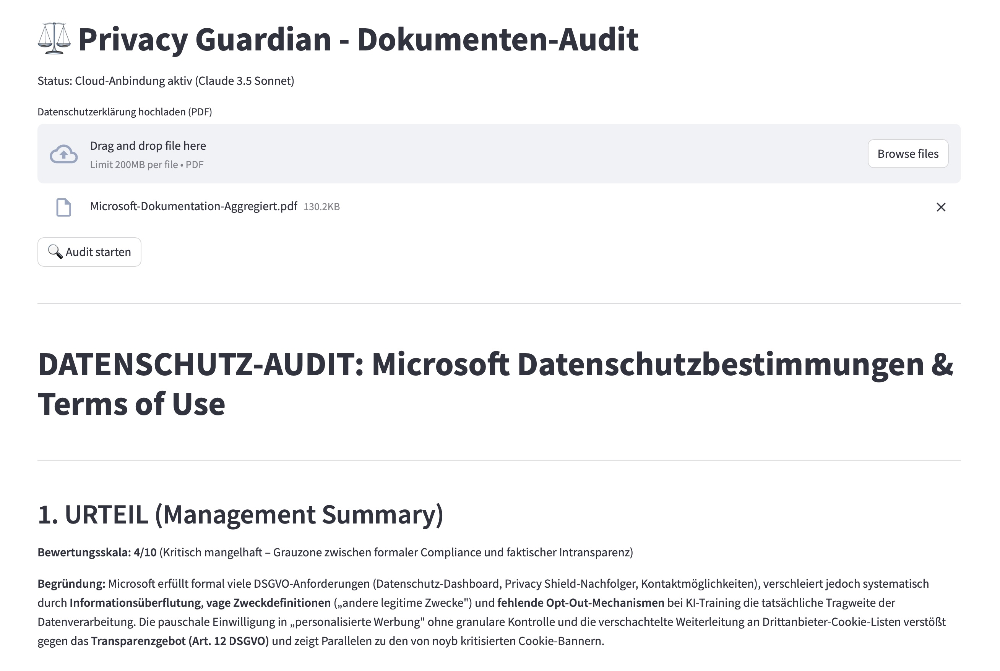

Angenommen, Europa schreibt alle Regeln – und andere bauen trotzdem die Infrastruktur. Was haben wir dann gewonnen?

Stefan Eder – Rechtsanwalt, IRIS-Programmvorsitzender und Plenary-Speaker - hat beim IRIS 2026 eine entscheidende Frage gestellt: **„Die Zukunft der juristischen Arbeit und die KI-Disruption in Europa."** Was folgte, waren dreieinhalb Tage, 105 Beiträge – und eine Antwort, die sich, fast symbolisch, in zwei Hälften teilte.

Das Internationale Rechtsinformatik-Symposium in Salzburg ist seit Jahren ein Seismograph für das, was Europa an der Schnittstelle von Recht und Technologie bewegt. Ich nehme seit vielen Jahren daran teil, halte Beiträge, diskutiere und lerne. Im Februar 2026 war die Mensch-Maschine-Interaktion das angesagte Thema.

## Die Zahlen: Eine Zweiteilung

Um mir nachträglich einen thematischen Überblick zu verschaffen, habe ich mit Claude Code – und dank meines Stanford Data Science Bootcamp Certificate (2025) ;-) – eine qualitative Themenklassifikation aller 105 IRIS-Beiträge erstellt.

Das Ergebnis ist eindeutig: **AI & Machine Learning stellt mit 49 Beiträgen die grösste Themengruppe** der Konferenz – mehr als doppelt so viele wie die nächstgrössten Kategorien (Data Governance & Regulation mit 19, Data Protection & Privacy mit 18).



Zählt man die regulierungsnahen Themen zusammen – Datenschutz, Governance, IP, Cybersecurity, E-Commerce-Recht, so ergibt sich eine Zweiteilung: Etwa die Hälfte der Beiträge beschäftigte sich mit den Möglichkeiten und dem Einsatz von AI, die andere Hälfte mit rechtlichen, ethischen und regulatorischen Rahmenbedingungen.

Das ist zunächst keine Überraschung. Das Wesen einer Rechtsinformatik-Konferenz ist genau diese Vielfalt. Aber die Zweiteilung sagt etwas aus über die missliche regulatorische Lage, in der sich Europa befindet.

## Die eine Hälfte: AI ist angekommen

Die Vielfalt der Beiträge und Anwendungsbeispiele über AI war beeindruckend und konkret.

Friedrich Lachmayer und Vytautas Čyras eröffneten mit einer philosophischen Perspektive: Ihr Beitrag über den Übergang vom *Status Naturalis* zum *Status Virtualis* von Maschinen zeigt, dass AI-Agenten, die sich rechtlichen Status anmassen, die gesamte juristische Systematik und Ontologie verändern. Das wirkt akademisch, agentisches Handeln ist aber spätestens seit den OpenClaw-Schlagzeilen schon fix im digitalen Alltag angekommen.

Michael Löffler legte handfest dar, warum Europa eigene AI Factories braucht – und dass es sie vor allem schon gibt: Österreichs Initiative AI:AT liefert nicht nur Rechenkapazität, sondern Infrastruktursouveränität.

Zwei Beiträge haben die laufende Transformation historisch eingeordnet. Wolfgang Pichler zeichnete nach, wie sich das juristische Ökosystem in 40 Jahren gewandelt hat – welche Institutionen, Rollen und Denkmuster entstanden, verändert oder verschwunden sind. Es ist ein Bild, das Bescheidenheit verlangt: Wer glaubt, die nächsten vier Jahrzehnte vorhersagen zu können, hat die letzten nicht aufmerksam verfolgt. Angela Stöger-Frank ergänzte diesen Bogen auf konkreter Ebene: Vierzig Jahre österreichische Rechtsdatenbanken – von RDB und RIS über FINDOK bis zu Manz Genjus, Lexis+AI und LinDa-KI. Was früher aufwendige Recherche war, ist heute dialogisierte Mensch-Maschine-Interaktion. AI tritt nicht von aussen an das Recht heran – sie verändert es von innen.

Meinen eigenen ersten Beitrag habe ich der Frage gewidmet, wie künstliche Intelligenz Rechtsentscheidungen unterstützen kann – und welche **semantische Validierungspflicht** dabei entsteht. Wenn ein KI-System juristische Empfehlungen ausspricht, reicht syntaktische Textschöpfung nicht aus. Die generierte Information ist zunächst **abjektiv** – weder objektiv bewertet noch subjektiv eingeordnet, epistemisch inhaltsleer bis zur menschlichen Validierung. Ähnlich wie bei Schrödingers Katze wissen wir erst, ob etwas im konkreten Rechtsfall richtig ist, wenn wir die von der KI gelieferte Information öffnen und sie semantisch validieren. Wir brauchen organisatorische White-Box-Strukturen, die sicherstellen, dass Bedeutung nicht verloren geht – dass AI Juristinnen und Juristen befähigt, nicht heimlich ersetzt. **Der Mensch bleibt das Mass** – nicht als romantische Gegenwehr gegen AI, sondern als epistemische Notwendigkeit.

## Die andere Hälfte: Regulierung ohne Klarheit

Und dann gibt es das regulatorische Dickicht – es war auf der IRIS 2026 ebenso präsent. Es verdient eine systemische Betrachtung, keine blosse Aufzählung.

Marie-Therese Sekwenz traf es mit ihrem Titel auf den Punkt: *„Wicked by Design: Regulating and Auditing Platforms under the Digital Services Act."* Die aktuelle EU-Regulierung ist strukturell so angelegt, dass sie von überwindbarer Alltagskomplexität zur allgegenwärtigen Systembedingung wird. Einzelne erratische Rechtsquellen sind ein Problem; ihre Vielzahl ohne innere Kohärenz ist ein Systemproblem – und es untergräbt die Idee des digitalen Binnenmarkts, der noch in Art. 1 Abs. 3 DSGVO als Ziel genannt wird.

Markus Schröder analysierte den **Brüssel-Effekt**: Die DSGVO hat weltweit Massstäbe gesetzt – andere Staaten und globale Unternehmen richten sich daran aus. Und gleichzeitig setzt der Omnibus-Kompromiss konzeptionelle Grundlagen wie den Begriff der personenbezogenen Daten aufs Spiel: Der AI Act führt Registrierungspflichten für Hochrisiko-Systeme ein, sieht per Omnibus aber wieder Ausnahmen vor. Diese rechtsdogmatischen Wunden heilen nicht durch Pflaster. Schröders Befund impliziert: Die EU riskiert, ihre eigene regulatorische Glaubwürdigkeit zu verspielen.

Tobias Gösslbauer (mit Karl Pinter und Thomas Grechenig) präsentierte zum eIDAS 2.0 einen strukturellen Befund, der über den Einzelfall hinausweist: **Technologiefremde Formulierungen erzeugen keine Umsetzungsklarheit – sie erzeugen Implementierungsleere.** Wenn ein Gesetz absichtlich offen lässt, welche Technologie zu verwenden ist, damit es „zukunftsfähig" bleibt, entsteht für jene, die es umsetzen müssen, ein Vakuum. Wer technisch vorprescht, riskiert im Nachhinein bestraft zu werden. Das ist rechtliches Designversagen – *wicked by design*.

Gernot Fritz fragte, ob der AI Act Deepfakes wirklich schützen kann, wenn die Technologie der Regulierung um Längen voraus ist. Natalia Trudova und Helmut Lindner untersuchten konkret, was der AI Act für KMU in Österreich bedeutet – eine Frage, die viele Organisationen gerade beschäftigt. Christoph Sorge und Nils Wiedemann analysierten, wie EuGH-Rechtsprechung die Verschlüsselung personenbezogener Daten beeinflusst. Maria A. Wimmer (Universität Koblenz) analysierte Grundkonzepte und Komponenten von Data Governance in Data Trusts – und agiert damit auf einer konzeptuellen Verschiebung: Bislang war Informations- und Datenschutzrecht primär auf Beschränkung und Ausschluss ausgerichtet; Data Trusts fordern eine Governance-Architektur des gezielten Teilens. Das stellt neue Anforderungen an Rechtsdogmatik und Umsetzung gleichermassen. František Kasl und Veronika Příbaň Žolnerčíková machten am Beispiel der Justiz deutlich, was diese Regulierungsdichte praktisch erzwingt: Wer in einem solchen Umfeld noch etwas erproben will, braucht regulatorische Sandboxes – Freiräume, in denen Innovation möglich ist, bevor sie an den Anforderungen des Normbetriebs scheitert.

Mariana Rissetto (mit Martin Griesbacher und Martin Maier) brachte es am deutlichsten auf den Punkt: Wenn ein Krankenhaus Patienten darüber informiert, dass Testergebnisse verfügbar sind, passiert das heute über gängige Smartphone-Messaging-Systeme – Systeme, die technisch von globalen Plattformanbietern kontrolliert werden. Die rechtlichen Graubereiche, die dabei entstehen, entstehen nicht durch schlechten Willen. Sie entstehen im Schatten der grossen digitalen Monopolisten, in deren Infrastruktur wir operieren, ohne deren Regeln wirklich zu kennen. **Mangelndes Enforcement ist keine Randerscheinung – es ist europäische Rechtsrealität.**

Wir haben annähernd 50 europäische Rechtsakte im digitalen Raum. Viele widersprechen sich, überlappen oder sind technisch nicht umsetzbar. Das ist kein Detailproblem. Das ist ein Wicked Problem – und viele Beiträge auf der IRIS 2026 haben es in seiner ganzen Breite sichtbar gemacht.

## Was mein zweiter Beitrag zeigte: Der Schwanz wedelt mit dem Hund

Mein zweiter Beitrag auf der IRIS widmete sich dem Verhältnis zwischen Microsoft und europäischen Organisationen – am konkreten Beispiel der IRIS-Konferenzsoftware selbst.

Der Befund: Inhalte, die Autoren bei IRIS eingereicht hatten, wurden auf Microsoft-Servern verarbeitet. Microsoft – wie jeder andere Cloud-Anbieter – besitzt potenziell technische Hoheit über Create, Read, Update und Delete. Verschlüsselung lindert das Problem; bei Delete (Abschaltung) ist konzeptionell kein Kraut gewachsen. Umsichtige Business-Continuity- und Disaster-Recovery-Massnahmen sind unumgänglich, um digitale Souveränität zu gestalten.

Die Standard-Compliance-Dokumente – die Autorinnen und Autoren unterzeichnen mussten – bezeichne ich als *Obscuratio per verbositatem*: Verdunkelung durch Wortfülle. Mein **Privacy Guardian**, ein AI-gestütztes Assessment-Programm zur Bewertung von Rechtskonformität und Verständlichkeit von Datenschutzerklärungen, legte die Komplexität schonungslos offen. Bei normaler Lesegeschwindigkeit würde einfache Lektüre schon über 60 Minuten dauern. Diese Dokumente erwecken den Eindruck von Kontrolle, während sie faktisch Unsicherheit maximieren und Macht in Richtung Provider verschieben.



Dass dieses Problem kein Microsoft-Spezifikum ist, zeigte Kristina Lapin (Vilnius University) eindrücklich: Wer die AGB und Datenschutzerklärungen von Facebook vollständig liest, braucht dafür 160 Minuten – bei X sind es immerhin noch 45. *Obscuratio per verbositatem* ist Branchenstandard.


Das DSGVO-Rollenmodell sieht vor, dass der **Verantwortliche** den **Auftragsverarbeiter** kontrolliert. Die Realität sieht anders aus: Microsoft als Processor besitzt die Infrastruktur und setzt die Bedingungen. Vendor Lock-in macht Souveränität zudem ökonomisch schwierig. Selbst die EU-Kommission, gerüstet mit den besten Rechtsabteilungen Europas, konnte Telemetrie-Abflüsse zunächst technisch nicht stoppen. **Juristische Expertise allein garantiert keine technische Souveränität.**

## Was braucht es? Drei Erkenntnisse, die sich anwenden lassen

Stefan Eders Frage hat die IRIS 2026 nicht abschliessend beantwortet – aber das Spannungsfeld vorgezeichnet. Und die Antwort auf die eingangs gestellte Frage – *Was haben wir gewonnen, wenn wir alle Regeln schreiben, aber andere die Infrastruktur bauen?* – lautet: weniger als wir denken.

Drei Erkenntnisse, die sich direkt anwenden lassen:

**1. Bei fremden Compliance-Dokumenten: Wachsam sein. Bei eigenen: Verantwortung übernehmen.**
Die Datenschutzerklärung der zunächst eingesetzten Microsoft basierten IRIS-Konferenzsoftware erfoderte laut Privacy-Guardian-Analyse eine blosse Lesezeit von über 60 Minuten. Der Zustimmungsklick täuscht, da man rechtlich gesehen eigentlich unterschreibt. Dagegen lässt sich wenig tun, ausser sich zu vergewissern, ob man dies wirklich möchte. Was sich aber kontrollieren lässt: die Dokumente, die man selbst erstellt. *Obscuratio per verbositatem* ist kein exklusivder Fauxpas der Tech-Konzerne – sie schleicht sich schnell in jeden Servicevertrag, jede Datenschutzerklärung, jede Nutzungsbedingung, die unter Zeitdruck entsteht. UX-Design und Legal Usability Design sollte auch für Rechtsdokumente selbstverständlich werden. 

**2. KI-Output braucht epistemische Kontrolle, nicht nur technische.**
KI kann juristische Texte syntaktisch perfekt formulieren und trotzdem inhaltlich falsch liegen. Wer AI in der Rechtsarbeit einsetzt, braucht eine klare organisatorische Antwort auf die Frage: *Werden Bedeutung und Kontext im eigenen Prozess mit dem notwendigen Fachverstand validiert?* Das ist keine romantische Gegenwehr gegen KI. Es ist die notwendige systemisch-epistemische Integration.

**3. Souveränität ist eine Architekturentscheidung – keine Compliance-Checkbox.**
Selbst die EU-Kommission, ausgestattet mit den besten Rechtsabteilungen Europas, konnte Telemetrie-Abflüsse durch Microsoft 365 zunächst technisch nicht stoppen. Das zeigt: Wer nur Rechtsregeln schreibt, zieht gegenüber der Architektur den Kürzeren. Die entscheidende Frage ist nicht, ob man DSGVO-konform *ist*, sondern ob man die Infrastruktur *kontrollieren kann*, auf der die eigenen Daten leben. Das STORMLY-Framework setzt genau hier an: Strategische Entscheidungen müssen der technischen Umsetzung vorausgehen und juristische Klauseln können weder strategische noch technische Versäumnisse heilen – nicht umgekehrt.

---

Die USA stellen derzeit 75 % der globalen AI-Rechenleistung. Es wirkt paradox – aber diese Kapazität lässt sich nutzen, um europäische Souveränität aufzubauen, nicht um sie weiter zu verlagern. *Vibe Compliance* – Values In Built Environments – zeigt eine mögliche Richtung: Werte und rechtliche Anforderungen nicht in Dokumenten beschreiben, sondern direkt in IT-Umgebungen einbauen. Compliance als inhärentes Systemmerkmal statt als nachgelagerte Dokumentflut.

Das ist kein technisches Problem. Es ist ein Verständnis und Kompetenzproblem – auf individueller, organisationaler und gesellschaftlicher Ebene, das sich lösen lässt.

Das STORMLY-Framework:

```{mermaid}
graph TD
    S["S – Strategic Direction\nSouveränität als Architekturentscheidung"] --> T["T – Technical Implementation\nVerschlüsselung, BCDR, Zero Trust"]
    T --> O["O – Organizational Governance\nRollen, Prozesse, Verantwortung"]
    O --> R["R – Risk Management\nRealistisch, nicht theoretisch"]
    R --> M["M – Management Alignment\nFührungsentscheidungen & Ressourcen"]
    M --> L["L – Legal Safeguards\nVerträge, DPA, Compliance"]
    L --> Y["Y – Usability & Yield\nSchutz, der im Alltag funktioniert"]
    Y -.->|Feedback & Anpassung| S
```

---

## Glossar

**Abjektiv:** Begriff für KI-generierten Output, der syntaktisch korrekt erscheint, aber noch keine semantische Bewertung oder pragmatische Einordnung erfahren hat – weder subjektiv wahrgenommen noch objektiv (intersubjektiv) eingeordnet. Inhaltsleer bis zur menschlichen Validierung.

**Brüssel-Effekt:** Phänomen, bei dem EU-Regulierungen (insb. die DSGVO) de facto global wirken, weil multinationale Unternehmen einheitliche statt mehrfache Standards bevorzugen.

**Empowerment through Clarity:** Beratungs- und Organisationsansatz, der nicht auf dauerhafter Abhängigkeit von Expertise beruht, sondern auf Befähigung zur Selbstwirksamkeit. Klarheit ist dabei nicht Simplifizierung, sondern präzise Durchdringung von Komplexität.

**Implementierungsleere:** Rechtliches Designproblem, das entsteht, wenn technologieneutrale oder technologieindifferente Formulierungen keine ausreichenden Handlungsanweisungen für die Praxis liefern (hier: eIDAS 2.0).

**Knowledge Internalization:** Organisationale Strategie, bei der spezialisiertes Wissen (z.B. zu DSGVO, AI Act, ISO 27001) systematisch intern aufgebaut und integriert wird – statt dauerhaft extern eingekauft zu werden.

**Obscuratio per verbositatem:** (lat.) Verdunkelung durch Wortfülle. Begriff für Compliance-Dokumente, die durch übermässige Länge und Komplexität faktisch unlesbar und damit kontrollentziehend wirken.

**Semantische Validierungspflicht:** Pflicht zur inhaltlichen Überprüfung KI-generierter juristischer Empfehlungen. KI kann Syntax erzeugen, nicht aber Bedeutung verbürgen – diese muss menschlich validiert werden.

**Status Virtualis:** Begriff von Lachmayer/Čyras für den potenziellen rechtlichen Status von AI-Agenten; Gegenstück zum *Status Naturalis* biologischer Entitäten.

**STORMLY:** Framework für Datensouveränität – Strategic direction, Technical implementation, Organizational governance, Risk management, Management alignment, Legal safeguards, Usability & Yield.

**Vibe Compliance:** Ansatz zur Einbettung von Werten und rechtlichen Anforderungen direkt in IT-Umgebungen (Values In Built Environments). Compliance als inhärentes Systemmerkmal statt als Dokument.

**Wicked Problem:** Systemisches Problem ohne eindeutige Lösung, bei dem jeder Lösungsversuch neue Probleme erzeugt. Begriff aus der Systemtheorie (Rittel/Webber, 1973). Hier verwendet für die strukturelle Inkonsistenz der EU-Digitalregulierung.

---

*Dr. iur. Peter Ebenhoch ist Legal Counsel und Legal-Tech-Experte mit Schwerpunkt auf Datensouveränität, AI-Compliance und dem Einsatz von KI in der Rechtspraxis. Er bloggt auf [peterebenhoch.com](https://peterebenhoch.com) und entwickelt Tools für rechtliche Klarheit und organisationale Befähigung.*

*Kontakt & mehr: [peterebenhoch.com](https://peterebenhoch.com)*
