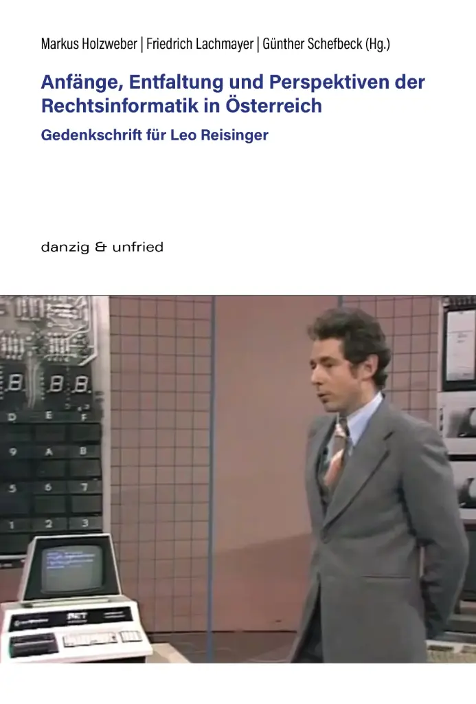

{fig-align="center" width="60%"}

## Abstract des Beitrags

Leo Reisinger war einer der Pioniere der Rechtsinformatik in Österreich. Er hat die Rechtsinformatik als eine wissenschaftliche Disziplin entwickelt und sie zu einem wichtigen Teil der Rechtswissenschaft gemacht. In diesem Artikel gehe ich am Beispiel einzelner Aufsätze von ihm auf die Aktualität seiner wissenschaftlichen Methodik und die Rolle der Wissenschaft in der Rechtsinformatik ein.

## Bibliographische Details

**Buchbeitrag** in einem Sammelband  
Seiten 163–180

**Titel:** Anfänge, Entfaltung und Perspektiven der Rechtsinformatik in Österreich – Gedenkschrift für Leo Reisinger  
**Herausgeber:** Markus Holzweber, Erich Lachmayer, Christoph Schefbeck  
**Verlag:** Danzig und Unfried Publishing  
**Erscheinungsjahr:** 2025  
**ISBN:** 978-3-99072-006-6  

[→ Zum Sammelband](https://www.danzigunfried-publishing.com/shop/holzweber-lachmayer-schefbeck-anfaenge-entfaltung-und-perspektiven-der-rechtsinformatik-in-oesterreich-74)

